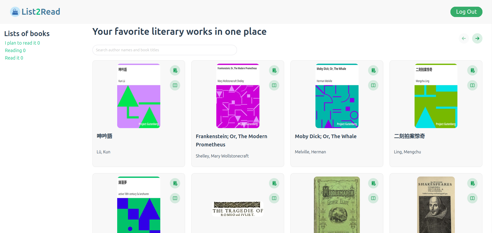

<h1 align="center">List2Read</h1>

## Учебный проект на курсе Vue.js

### Стэк

#### <pre> Vue3 (VueRouter,Pinia)
#### <pre> Vite
#### <pre> TypeScript
#### <pre> JSON web API for Project [Gutenberg](https://gutendex.com/) ebook metadata
#### <pre> Lint with [ESLint](https://eslint.org/)

# <pre> 


### Задание

#### Что нужно сделать
Напишите новое приложение «Книжная полка». В нём пользователь будет выбирать книги и добавлять их в свой список для прочтения.


#### Необходимая функциональность:

1) Есть авторизация пользователя (подробнее о механизме авторизации — в примечаниях).

2) Есть «Выбранные книги» для авторизованных пользователей.
3) Книги в списке имеют статусы «Планирую прочесть», «Читаю»/«Прочитал».
4) Книги можно добавлять в список и удалять из него.
5) Неавторизованным пользователям доступен только список всех книг на главной странице.
6) В случае выхода из аккаунта пользователя корректно переносит на главную страницу.
7) Отображается количество книг, добавленных в список книг на прочтение, и количество книг в статусе «Читаю» и «Прочитал».
8) Есть поиск по книгам и списку на прочтение:
- Можно реализовать поиск только по названию.
- Либо добавить фильтр в списке на прочтение по статусу: «Планирую прочесть», «Читаю»/«Прочитал».


#### Что оценивается
- Работа по задачам выполнена в сторах Pinia.
- Компоненты взаимодействуют со сторами.
- Отсутствуют ошибки в логике при работе со сторами.
- Все пункты задания выполнены.

#
### Инициализация проекта
```sh
npm install
```

### Запуск проекта

```sh
npm run dev
```
